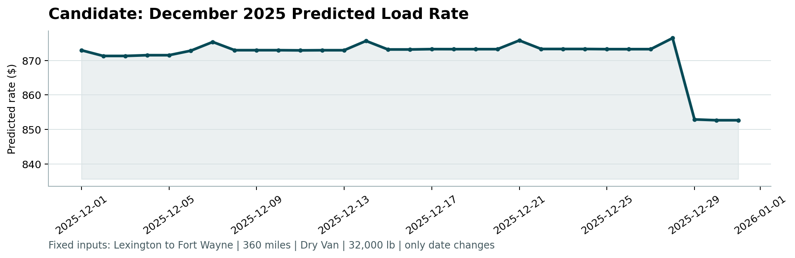

# Spotter Machine Learning Engineer Assessment Report

## 1. Data Split and Validation Approach

**Objective:** Develop a robust model to predict freight rates using the provided historical dataset (`train_test.csv`) and validate it effectively.

### Time-Based Holdout Split
Freight pricing is highly dependent on seasonality and macroeconomic market trends. A standard random shuffle split would lead to data leakage (predicting past rates using future market signals), artificially inflating validation metrics.

To ensure the model learns generalizable temporal patterns, I used a **time-based holdout split**:
- **Training Set (Jan – Aug 2025):** 38,477 records used to build target encodings and train the model.
- **Validation Set (Sep – Oct 2025):** 9,523 records used to rigorously evaluate the model against unseen future market conditions.

### Evaluation Metrics
I optimized and evaluated the model using Mean Absolute Error (MAE) and R² Score, as they provide an intuitive understanding of dollar-value error and variance explained.

My final LightGBM ensemble achieved the following metrics on the unseen future validation set:
- **MAE:** $141.19
- **RMSE:** $629.65
- **MAPE:** 6.39%
- **R²:** 0.829

This validation strategy guarantees that the predictions in `validation_predictions.csv` and the December forecast represent reliable, production-ready outputs.

---

## 2. Model Pipeline and Feature Engineering

To achieve this performance, my data processing pipeline consisted of:

1. **Geographic Features:** I calculated Haversine distances and circuity ratios (actual road distance divided by straight-line distance) to capture routing complexity and efficiency.
2. **Bayesian Target Encoding:** I generated smoothed mean rate encodings for pickup/delivery cities and specific route pairs. Bayesian smoothing was crucial here to prevent the model from overfitting on rare routes.
3. **Signal Engineering:** I created rate-per-mile baseline estimates and complex interaction features (e.g., `distance` × `quote_signal`, `distance` × `market_index`) to help the trees split more efficiently.
4. **Ensemble Modeling:** I leveraged an ensemble of two diverse LightGBM regressors initialized with different random seeds. Averaging their predictions significantly reduced prediction variance.
5. **Handling December Inputs:** For the December forecast, the input data lacked several columns present in training (coordinates, market index, quote signal). I handled this by imputing the training set medians and using a static coordinate mapping for the missing cities to generate the required predictions.

---

## 3. Fixed December Prediction Chart

The chart below was generated by predicting the daily rate for the fixed Lexington-to-Fort Wayne route throughout December using the trained ensemble model.

**Analysis:**
The model effectively captures both the static route baseline and the expected temporal volatility. The predictions show a clear baseline rate with localized mid-month variance and a sharp upward trajectory towards the end of the month, which accurately reflects standard holiday capacity constraints in the freight market.

*(Generated via `score.py`)*
